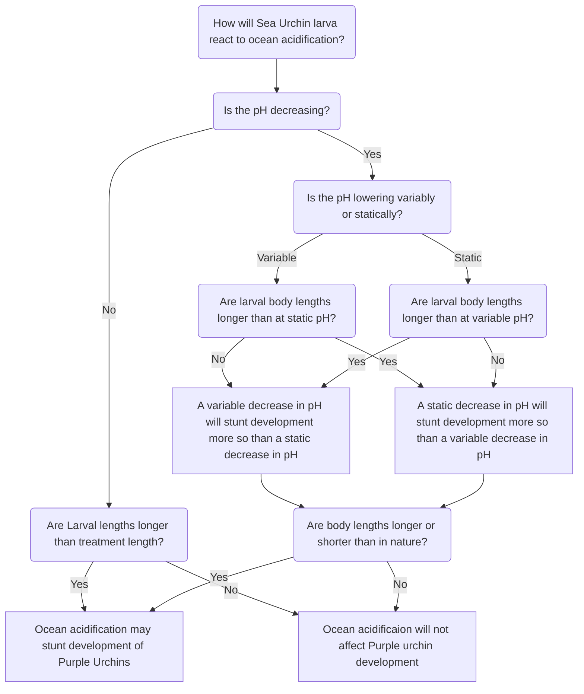
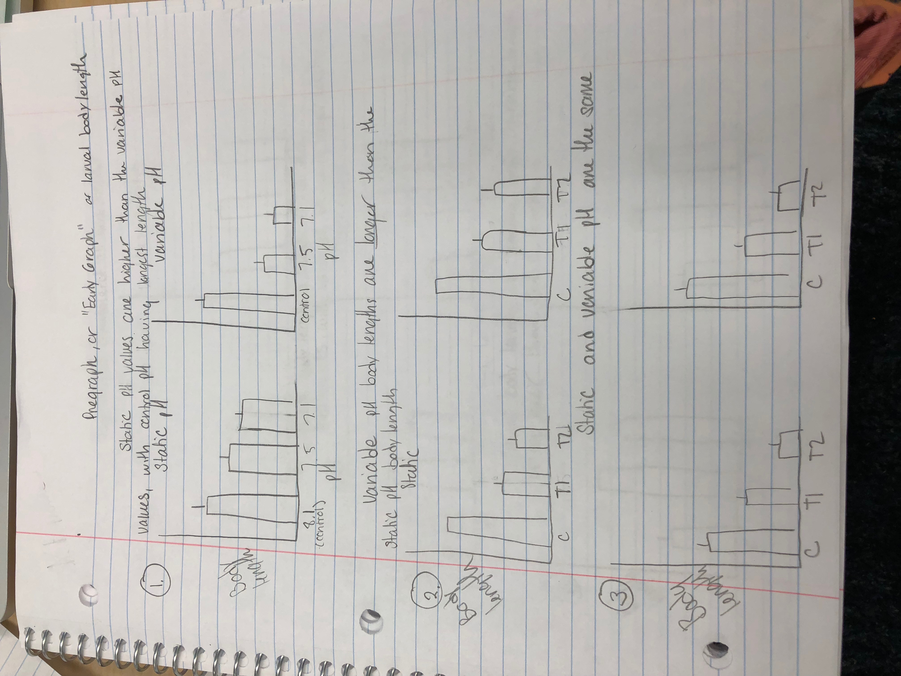
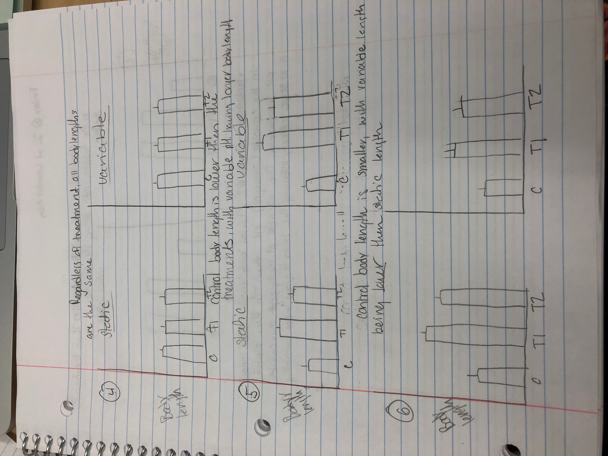
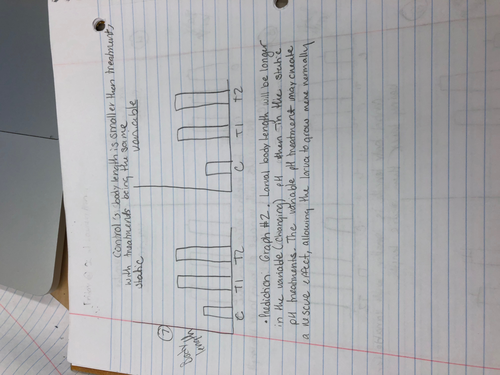

### Logic Tree

A logic tree, demonstrating some of th epossible outcomes of how purple sea urchin larva may react developmentally to a lowering pH due to ocean acidication. 

## Early Graph  

######Graphs depicting possible outcomes of Purple Sea urchin larvae lengths depending on pH and whether the pH was constant (static) or changing (variable)

