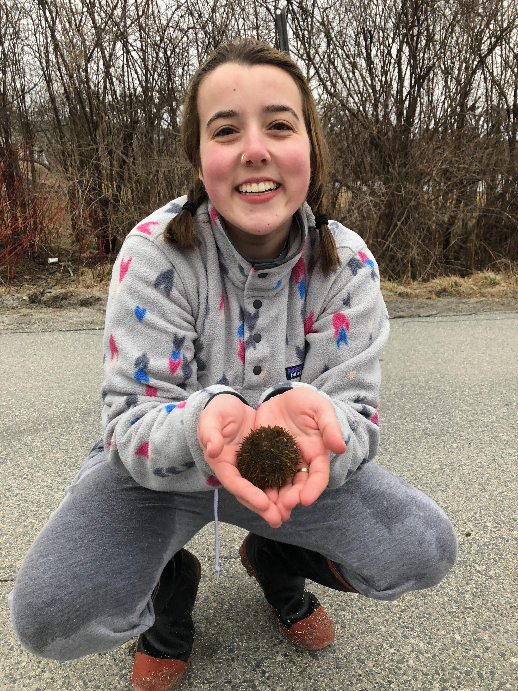

##Welcome!

email: Anya.Steinhart@uvm.edu
Office: Bailey Howe Library 

###About me 
I am a sophomore undergraduate biological science major at the University of Vermont. I currently work in the Pespeni lab as animal care, and assisting with research on purple sea urchins and ocean acidification! 

## Helpful Links   
* [Course Webpage](https://gotellilab.github.io/Bio381/)   
* [RMarkdown Cheatsheet](https://www.rstudio.com/wp-content/uploads/2015/02/rmarkdown-cheatsheet.pdf)   
* [Github website templates](https://github.com/jekyll/jekyll/wiki/Themes)   
* [R help](http://stackoverflow.com/questions/tagged/r)   

## Table of contents of Homework Assignments    
* [Create a Github website](https://anyasteinhart9898.github.io/BIOL-381/)
* [Logic Tree and Early Graph](Early Graph.html)
* [Beamer Slides on my Pets](deadpetz.pdf)
* [Basic coding practice](Homework_4.html)
* [Working with Regular Expression: ](Homework_5_.html)
* [Probability Distributions](homework6.html) 
* [Creating Fake Data Sets To Explore Hypotheses ](hw_7.html)
* [Organizing Code with Structured Programming](Homework9.html)   
* [Batch Processing ](Homework10.html)
* [Function Plotting and Randomization Tests](Homework11.html)
* [GGplot Graphs](Homework12.html)
* [I hope no one is paying attention](Trial.html)
------

### Week 2 
[Logic Tree and Early Graph](Early Graph.html)
------

### Week 3
[Beamer Slides on my Cats](deadpetz.pdf)
-----

### Week 4
[Basic coding Practice](Homework_4.html)
---

### Week 5
[Working with Regular Expression](Homework_5_.html)
---

### Week 6
[Probability Distributions](homework6.html)
---

### Week 7 and 8 
[Creating Fake Data Sets To Explore Hypotheses](hw_7.html)
---

### Week 10
[Organizing Code with Structured Programming](Homework9.html)
---

### Week 11
[Batch Processing](Homework10.html)
---

### Week 12
[Function plotting and randomization tests](Homework11.html)
---

### Week 13
[GGplot](Homework12.html)
---
